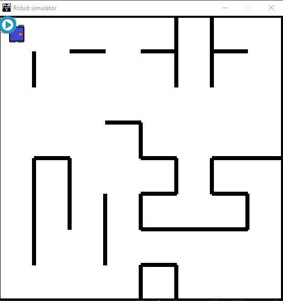
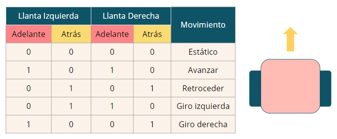

Última actualización: 19/03/2021


##
# **robotSim** (Taller)

_ **robotSim** _ es un proyecto en desarrollo; cualquier duda no duden en contactarse con los programadores RoBorregos:

| Nombre | Correo | Github |
| ---- | ----- | ------ |
| Aurora Tijerina | [auro.tj@gmail.com](mailto:auro.tj@gmail.com) | [@AuroTB](https://github.com/AuroTB) |


### Acerca de este proyecto

El simulador fue adaptado para el taller *Diseño de un sistema robótico*. En esta versión, se tiene un entorno específico para enseñar cómo programar el control de 2 motores para realizar movimientos básicos (adelante, atrás, giro izquierda y giro derecha).

Se puede ver la grabación del taller [aquí](https://fb.watch/4kSc98p-Yg/).

### Uso del simulador

#### Correr programa localmente

1. Clonar el repositorio del proyecto.

	SSH:

	```bash
	$ git clone git@github.com:RoBorregos/robotSim.git
	```

	o HTTPS:
	```bash
	$ git clone https://github.com/RoBorregos/robotSim.git
	```

2. Entrar al directorio del proyecto.

	```bash
	$ cd robotSim
	```

3. Cambia la la branch de *tallerRobotica*.

	```bash
	$ git checkout tallerRobotica
	```

4. Instalar dependencias del simulador.
	
	```bash
	$ pip install -r requirements.txt
	```

5. Codificar movimientos del robot dentro del main\_program.py

6. Simular Programa 
	```bash
	$ python robotsim.py
	```
#### Correr online en Repl.it

1. Entrar a https://repl.it/languages/pygame
2. Copiar todos los archivos del repositorio en el env
3. Poner comando en terminal: python robotsim.py 


### Información Archivos 
El repositorio tiene los siguientes archivos en un folder:

- **main\_program.py:** script donde se programan los movimientos del robot
- **map.json:** descripción del mapa, sirve como entrada para que el programa genere la imagen
- **map.py y robotsim.py:** building class para el objeto mapa y script de inicialización y actualización del entorno.
- **imágenes del programa:** imágen del robot y del botón de play (run.png y robot.png).

Para correr el programa, símplemente se debe de correr el comando:
```bash
	$ python robotsim.py
```


### Mapa



El mapa cuenta con las siguientes características:

- Dimensiones de 8x8
- Paredes alrededor de todo el perímetro a recorrer
- Líneas negras: paredes

Se puede cambiar la apariencia del mapa modificando el documento en *resources/map.json*

### Funciones del robot



| **Función** | **Descripción** | **Input/Output** |
| --- | --- | --- |
| robot.izqAdelante(0/1) | Gira la llanta izquierda del robot hacia enfrente | - |
| robot.izqAtras(0/1) | Gira la llanta izquierda del robot hacia atrás | - |
| robot.derAdelante(0/1) | Gira la llanta derecha del robot hacia enfrente | - |
| robot.derAtras(0/1) | Gira la llanta derecha del robot hacia enfrente | - |
| robot.prenderMotor() | Hace que se muevan los motores con la polaridad especificada por las funciones anteriores | - |
| robot.ultrasonicFront() | Obtiene la distancia (número de cuadrantes libres) al frente del robot | Output: int |

### Importante

Cuando se escriba código en main\_program.py se tienen que tomar en cuenta los siguientes detalles:

- Todo el código debe realizarse dentro de la función main()
- Si creas una función, de debe colocar como una función anidada
- Si se declara una variable, debe declararse dentro de main().

Con suerte, esto se puede solucionar en el futuro, pero por el momento se debe de realizar así para evitar que el programa tenga errores.

Si se identifica cualquier bug por favor manden mensaje a los programadores.
